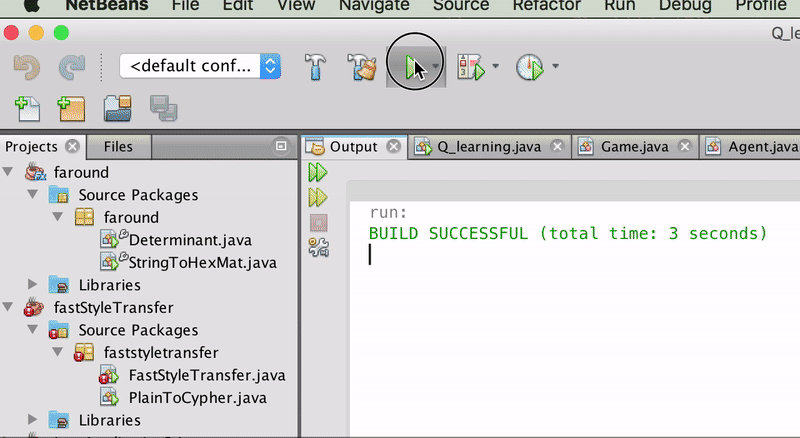

# Q-Learning
This program implements a basic q-learning algorithm for pathfinding. The agent initially has no knowledge of its environment. Over time it discovers through trial and error what part of the environment offers the greatest rewards. 

### Video

### Rules:
- There is an agent (magenta circle) that attempts to find the end of the maze. The agent always starts in the bottom left of the board. A new board is generated for each run.
 * There are three blocks which the agent can navigate through. 
 1. The red block is lava and forces the agent to restart. 
 2. The green blocks are neurtral and the agent does not get an feedback from entering that state. 
 3. The yellow block is the objective state. 
 
 The agent only receives information when it has to restart (ie when it succeeds or loses).
 
 
 
### How to use:
- clone the repo, compile, and run.

